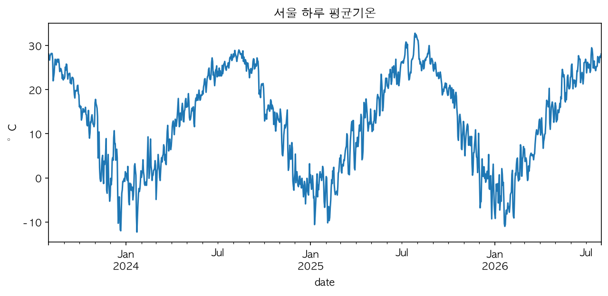

# M1. 시간이 담긴 데이터

시계열 데이터와 꺾은선 그래프

---

## 오늘부터 8개 모듈을 배운다

1. **M1. 시간이 담긴 데이터** ← 오늘
2. M2. 평균의 힘과 함정
3. M3. 추세 찾기 — 이동평균
4. M4. 반복되는 패턴 — 계절성
5. M5. 첫 예측
6. M6. 파이썬으로 다시 보기
7. M7. pandas 시계열 도구
8. M8. 미니 프로젝트

시계열을 **읽고 그리는 것**부터 시작한다.

---

## 오늘의 목표

- 시계열 데이터가 무엇인지 안다.
- 꺾은선 그래프를 **읽는다**.
- 꺾은선 그래프를 **그린다**.

---

## 데이터란 무엇인가

**데이터**는 관찰하거나 측정해서 기록한 값이다.

- 오늘 아침 몇 시에 일어났는지
- 어제, 그저께는 몇 시였는지

이런 숫자를 기록해 두면, 그게 바로 데이터다.

---

## "시간이 담긴" 데이터

같은 "키"라도 무엇을 기록하느냐에 따라 다르다.

| 반 친구들의 키 | 내 키의 변화 |
|---|---|
| 순서 없음 | 순서 있음 (시간 순서) |
| "누가 더 큰가?" | "자라고 있나?" |

시간 순서가 붙는 순간, **다른 질문**을 할 수 있게 된다.

---

## 시계열(time series)이란

> 숫자를 **시간 순서대로** 기록한 데이터

- 핵심은 **순서가 의미를 갖는다**는 것.
- 순서를 섞으면 안 되는 데이터다.
- 예: 매년 잰 내 키, 하루 평균 기온, 게임 랭크 점수의 변화.

---

## 시계열인 것 / 아닌 것

**시계열인 것** — 시간 순서로 기록된 숫자

- 매년 잰 내 키, 유튜브 일별 조회수, 오늘 배울 기온

**시계열이 아닌 것** — 한 시점에 여러 대상을 비교한 숫자

- 반 친구들의 키, 우리 반 학생들의 혈액형

판별 기준: **시간 순서가 있는가?**

---

## 꺾은선 그래프 해부

- **가로축(x축)**: 시간 (날짜, 연도 …)
- **세로축(y축)**: 값 (기온, 키 …)
- **눈금**: 축 위에 일정한 간격으로 매긴 표시
- **점**: 한 시점의 값 하나
- **선**: 점과 점을 이어서 변화를 보여준다

---

## 그래프 읽는 법

- 선이 **오르면** 값이 커진 것, **내리면** 작아진 것.
- 가장 높은 점이 **최고**, 가장 낮은 점이 **최저**.
- 짧은 구간만 보지 말고 **전체 방향**을 먼저 본다.

표는 숫자를 하나하나 비교해야 하지만, 그래프는 선의 모양만 보면 된다.

---

## 오늘 다룰 데이터

서울의 하루 평균기온

---

## 그래프 그리는 법 — 순서

1. **축 정하기**: 가로축은 시간, 세로축은 값
2. **눈금 정하기**: 일정한 간격으로 표시
3. **점 찍기**: 각 시점의 값을 점으로
4. **점 잇기**: 점과 점을 선으로 연결

날짜는 숫자가 아니라 날짜 형식으로 입력해야 그래프 축이 깨지지 않는다.

---

## 이제 활동지로

1. 숫자표만 보고 추세를 판단해 본다.
2. 스프레드시트에 입력해 꺾은선 그래프를 직접 그린다.
3. 3년치 데이터를 한 번에 불러와 살펴본다.
4. 내 주변의 시계열 데이터를 찾아본다.
