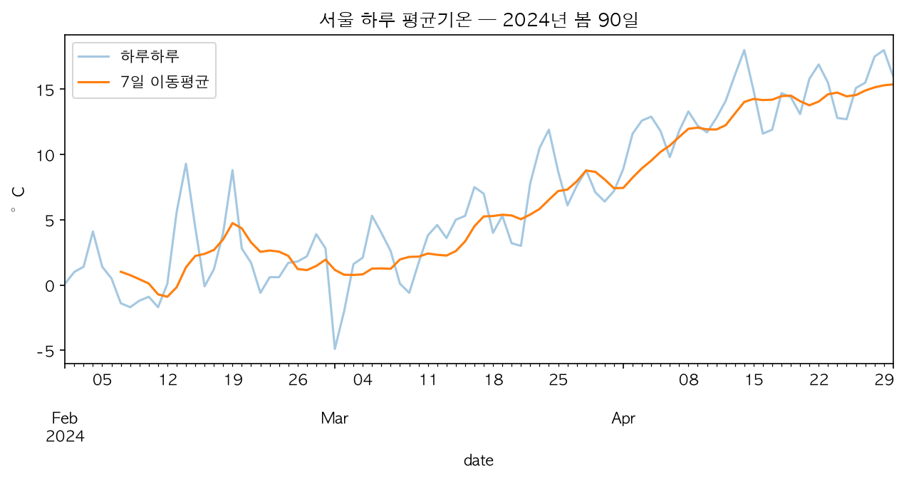

# M3. 추세 찾기 — 이동평균

잡음 속에서 흐름 찾기

---

## 지난 시간 복습 — M2

1. M1. 시간이 담긴 데이터
2. M2. 평균의 힘과 함정
3. **M3. 추세 찾기 — 이동평균** ← 오늘
4. M4. 반복되는 패턴 — 계절성
5. M5. 첫 예측
6. M6. 파이썬으로 다시 보기
7. M7. pandas 시계열 도구
8. M8. 미니 프로젝트

지난 시간엔 숫자 여러 개를 **평균 하나**로 요약하는 법을 배웠다.
오늘은 그 평균을 시간 축을 따라 **계속 반복**해서 낸다.

---

## 오늘의 목표

- 이동평균이 무엇인지 안다.
- "창(window)"이 무엇인지 안다.
- 이동평균을 손으로 계산한다.
- 창 크기가 커지고 작아질 때 무엇이 달라지는지 설명한다.
- 스프레드시트에서 이동평균을 구한다.

---

## 잡음과 추세

> 몸무게를 매일 재면 물 한 잔만 마셔도 오르락내리락한다.
> 오늘 500g 늘었다고 정말 살이 찐 걸까? 알 수 없다.

- 하루하루의 출렁임을 **잡음(noise)**이라 부른다.
- 잡음 속에 숨어 있는 진짜 방향을 **추세(trend)**라 부른다.
- 그래서 다이어트 앱은 "오늘 값" 대신 "최근 며칠 평균"을 보여준다.

---

## 이동평균이란

> 정해진 기간(창)의 평균을, 그 기간을 **하루씩 밀며** 계속 구한 값

- 평균 하나가 아니라, 평균이 **줄줄이 이어진 것**이다.
- 하루하루의 출렁임(잡음)이 평균 안에서 서로 상쇄되어 줄어든다.
- 남는 것은 잡음이 지워진 **부드러운 흐름**이다.

M2의 AVERAGE가 그대로 재료다. 다른 점은 그 평균을 한 번만 내지 않고
**계속 반복**한다는 것.

---

## 창(window)이란

> 평균을 낼 때마다 사용하는, **일정한 크기의 구간**

- 창 크기가 3일이면, 항상 최근 3일치만 평균에 들어간다.
- 다음 칸으로 넘어가면 창도 하루 **밀린다** — 맨 앞 날짜는 빠지고
  새 날짜가 들어온다.
- 창을 미는 이 동작을 계속 반복하는 것이 이동평균이다.

---

## 이동평균 계산 절차

한 동아리방의 하루 방문자 수(명)다. (3일짜리 창을 쓴다)

| 요일 | 월 | 화 | 수 | 목 | 금 |
|---|---|---|---|---|---|
| 방문자 수 | 42 | 58 | 25 | 61 | 47 |

1. 창 크기만큼 값을 모은다: 월, 화, 수 → 42, 58, 25
2. 평균을 낸다: (42+58+25) ÷ 3 = **41.7**
3. 창을 하루 민다: 화, 수, 목 → 58, 25, 61
4. 다시 평균을 낸다: (58+25+61) ÷ 3 = **48.0**

---

## 계산해보면 — 앞부분은 왜 비는가

방금 예시에서 "월" 칸과 "화" 칸에는 3일 이동평균을 쓸 수 없었다.

- 창이 3일이면, 3일치 값이 모여야 첫 평균이 나온다.
- 그 전 칸들은 채울 데이터가 부족해 **비워둔다**.
- 창이 클수록 이 빈 구간도 함께 길어진다.

---

## 창 크기가 하는 일

창 크기를 바꾸면 이동평균의 성격이 달라진다.

| 창을 작게 하면 | 창을 크게 하면 |
|---|---|
| 잡음이 더 남는다 | 더 부드러워진다 |
| 변화에 빠르게 반응한다 | 변화에 늦게 반응한다(둔감) |
| 시작 빈칸이 적다 | 시작 빈칸이 늘어난다 |

정답인 창 크기는 없다. **무엇을 보고 싶은지**가 창 크기를 정한다.

---

## 겹쳐 보면 드러나는 추세

원래 값과 7일 이동평균을 겹쳐 그리면 차이가 뚜렷이 보인다.

뾰족뾰족한 원래 값 사이로, 이동평균이 만든 부드러운 선이 지나간다.

---

## 스프레드시트에서 이동평균 구하기

1. 이동평균을 쓸 새 열에 제목을 붙인다.
2. 창 크기만큼의 범위를 잡아 `=AVERAGE(범위)`를 입력한다.
3. 그 셀을 다시 선택하고, 오른쪽 아래 파란 점(채우기 핸들)을
   **더블클릭**한다 — 맨 아래까지 자동으로 채워진다.
4. 원래 값 열과 이동평균 열을 함께 선택해 꺾은선 그래프를 그린다.

행이 아주 많을 때는 드래그보다 더블클릭이 훨씬 빠르다.

---

## 오늘 배운 세 문장

1. 이동평균은 창을 밀며 내는 평균이다.
2. 창이 클수록 부드럽지만 **둔하다**.
3. 무엇을 보고 싶은지가 창 크기를 정한다.

---

## 이제 활동지로

1. 손으로 며칠치 이동평균을 계산해 본다.
2. 3년 데이터에 이동평균 열을 만들어 그래프로 겹쳐 본다.
3. 창 크기를 바꿔가며 선이 어떻게 달라지는지 관찰한다.
4. 창 크기를 언제 무엇으로 골라야 할지 생각해 본다.
